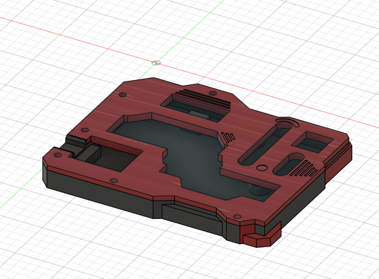
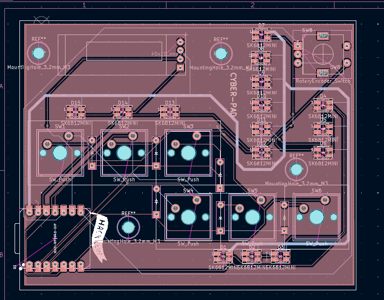
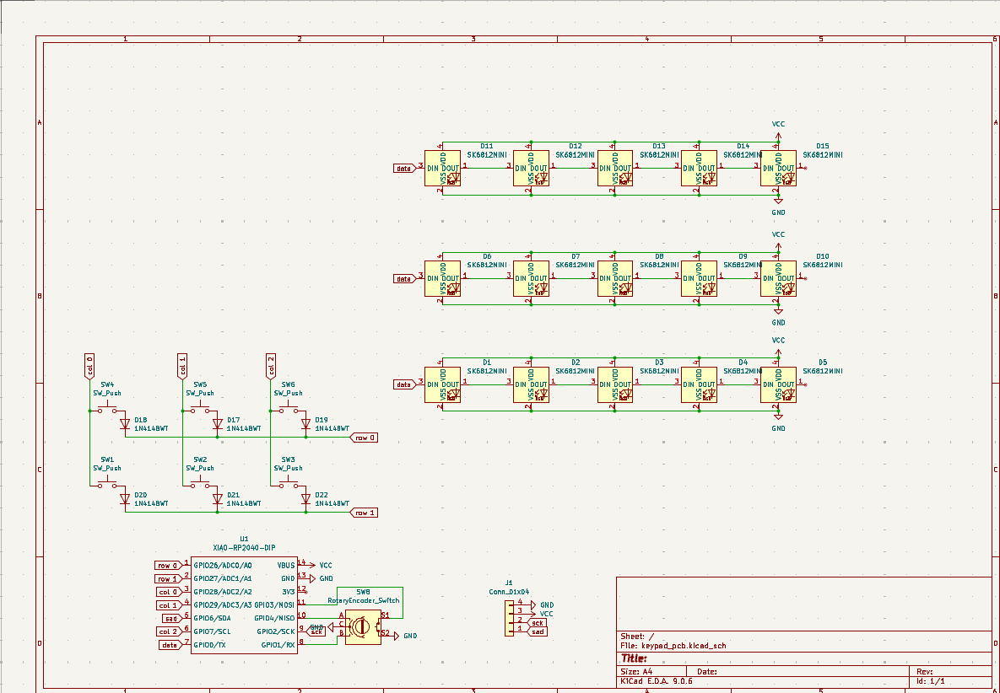
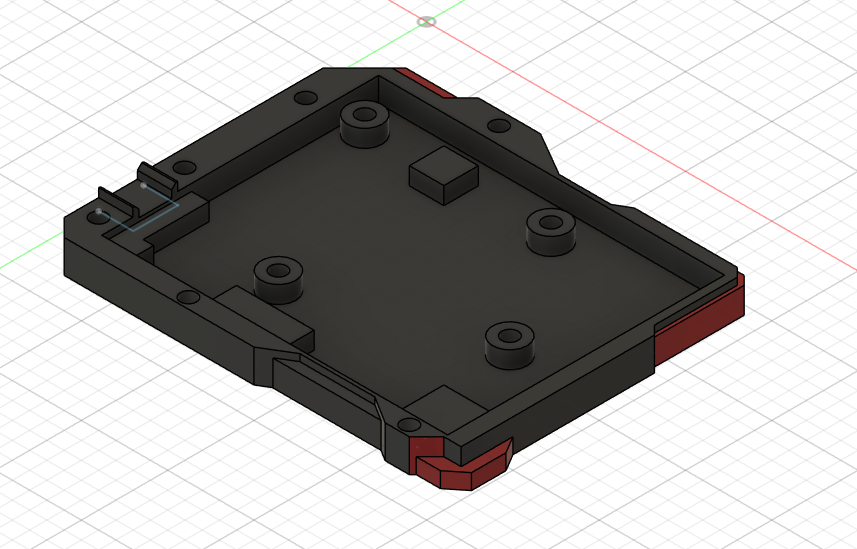
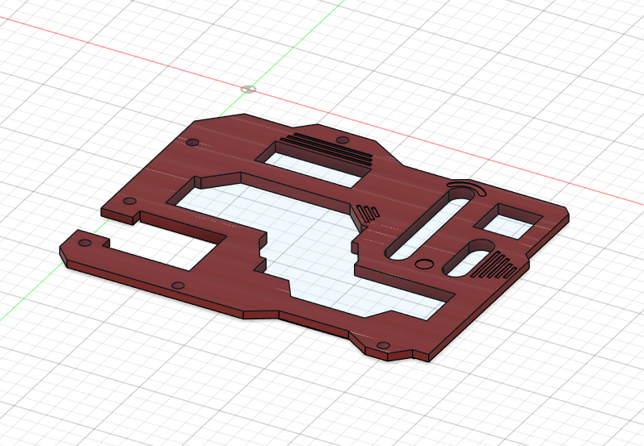
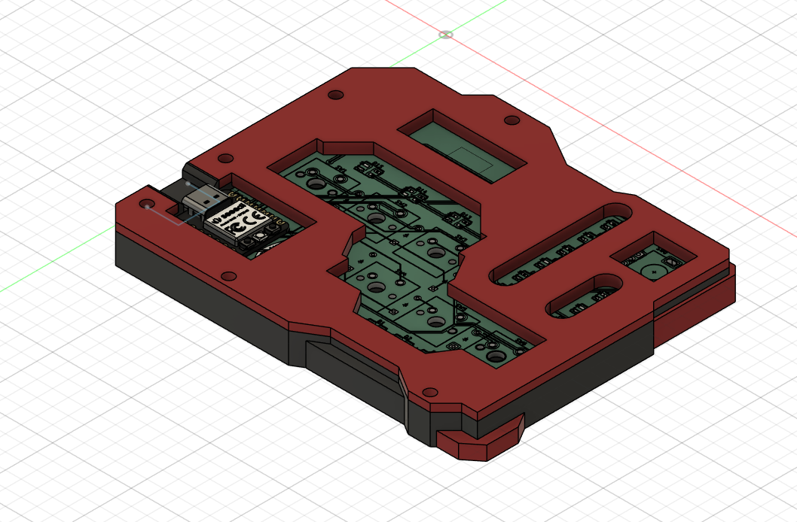

PROJECT-CLICK

PROJECT-CLICK is a **3×2 matrix macropad** with a **cyberpunk-inspired design**, built around the **XIAO RP2040**.
I tried to make it look good as posible and it was my first build so it will have its own problems
(the case is tight fit)

## Features
3x2 matrix 
multilayered keys
knob for volume 
display

## Hackpad Overview

> *Screenshot build*

## Schematic

The schematic includes:

* 6-key matrix with individual diodes
* OLED display connection
* Rotary encoder
* RP2040-based controller

Designed using **KiCad**.

> *Screenshot of the schematic*

## PCB

I used KiCad to design my PCB and used JLCPCB to get it printed

* Cherry MX switch 

> *PCBlayout*

## Case & Assembly

the case have two part top and bottom 

* Base (holds the PCB)
* Top plate 

scrwe used in this project is **M3 screws and heatset inserts**

> *Screenshot of the case and how it fits together*

## Firmware Overview

PROJECT-CLICK is designed to run **KMK firmware**.

Planned functionality:

* 6 programmable macro keys
* Rotary encoder for volume/scrolling/custom actions(such as multilayering)
* OLED display for status and layers.

(program is not perfect or tested yet since i am new to this )

## Bill of Materials

Everything required to build one PROJECT-CLICK unit:

### Electronics

* 6× Cherry MX switches
* 6× Blank DSA keycaps
* 6× 1N4148 DO-35 diodes
* 1× 0.91" 128×32 OLED display
* 1× EC11 rotary encoder
* 1× XIAO RP2040

### Hardware

* 10× M3×5×4 heatset inserts
* 15× M3×16mm screws

### Case

* 1× Case (2 printed parts)

## Tools Used

* **KiCad**
* **Fusion 360**
* **KMK** 
* **3D Printer** 

